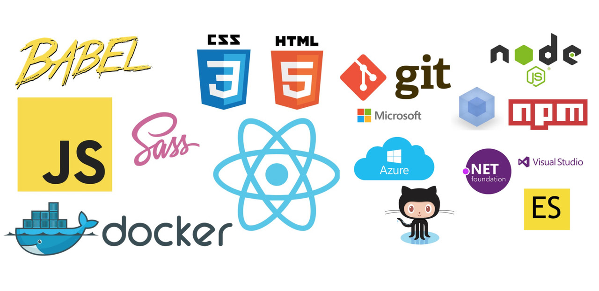

<h1 align="center">Hi 👋, I'm Siddhant Mahato</h1>
<h3 align="center">A passionate developer from India</h3>
 

# 💫 About Me: 
-🌱 I’m currently learning Web Development and Problem Solving  - 💬 Ask me about  Frontend Development  -📫 How to reach me  siddhantstar252@gmail.com  -⚡ Fun fact I am Good because of God

## 🌐 Socials:
  

# 💻 Tech Stack:
                               

# 📊 GitHub Stats:
 
 

### ✍️ Random Dev Quote

### 🔝 Top Contributed Repo

---

<!-- Proudly created with GPRM ( https://gprm.itsvg.in ) -->
